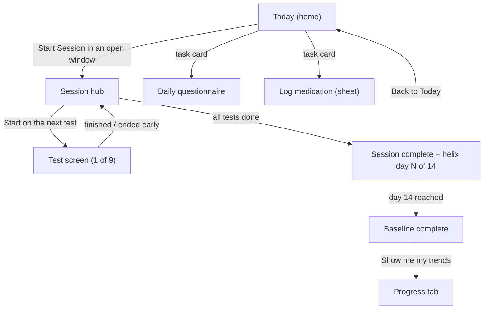

# Dashboard & Session Flow — Implementation Plan

**Owner:** Management Agent
**Design source:** [Figma · Dopa-X user app · `Current Design` (`6349:3764`)](https://www.figma.com/design/i5oPtuH9OIBnWGFwYE2F3E/Dopa-X---user-app?node-id=6349-3764&m=dev)
**Status:** In build — Phase 1 and Phase 3 landed on iOS; see §0
**Scope:** Today (dashboard) screen, session hub, session complete, day-14 baseline, and the tab shell that holds them. Individual test screens, onboarding, and backend are out of scope except where they are wired into this flow.

---

## 0. Status

| Phase | iOS | Android |
| --- | --- | --- |
| 1 — Session domain model | Done, 68 unit tests green | Not started |
| 2 — Navigation shell | Partial — Today added as first tab; four-tab rework outstanding | Not started |
| 3 — Today screen | Done | Not started |
| 4 — Session hub | Not started | Not started |
| 5 — Session complete + baseline | Not started | Not started |
| 6 — Polish | Not started | Not started |

**Decisions settled during Phase 3:** D2 = 9 tests per session (the `6` labels are stale design
copy and still need a designer fix). D7 = `testTimeNoon` added additively to `UserProfile`,
defaulting to `12:00-14:00`; no existing stored window is read or cleared. D8 = static bundled
article list, no flag.

**Interim choices to revisit in Phase 2:**

- Today is the first of five tabs. `DataExportView` moved from its own tab into a Settings row so
 the bar stays at five items and iOS does not collapse tabs into "More". Every destination is
 still reachable; this is reversible and superseded by the four-tab shell.
- Tapping Start/Resume begins the session and switches to the Tests tab, because the hub does not
 exist yet. Phase 4 replaces that jump with the hub.
- The noon window is stored and scheduled but not yet editable in onboarding or Profile, which
 still expose only morning and evening.

**Incidental fix:** `HandLandmarkOverlayView.swift` was committed but had never been added to the
checked-in Xcode project, so its `Color.magenta` reference had never compiled. Regenerating with
XcodeGen pulled it in and broke the build; it now uses `Color(uiColor: .magenta)`.

---

## 1. The flow, as designed

The app is a **time-windowed daily protocol**, not a metrics dashboard. The user is guided through three short sessions per day, and for the first 14 days those sessions are teaching the model a personal baseline.

### 1.1 Today — `Today · full scroll` (`532:9932`, `573:10600`)

- Hero: `SUNDAY, JULY 26` + `Good afternoon, Alex` (time-of-day greeting).
- **`TODAY'S SESSIONS`** — three cards: Morning, Noon, Night. Exactly one card is expanded (112pt) and the other two are collapsed (68pt). The expanded one is the session that is actionable right now; the two Figma variants of this screen differ only in *which* card is expanded, which confirms the card is a single component with states.
- **`TODAY'S TASKS`** — two task cards (daily questionnaire, log medication). In `Today · tasks completed states` (`477:49`) only one task card remains, so completed tasks are removed from the row rather than shown greyed.
- **`FOR YOU`** — horizontally paged news/article carousel with a page control.
- Tab bar: Today · Tests · Progress · Profile.

### 1.2 Session hub — `Evening session · in progress (hub)` (`551:2`)

- Back link to Today, title `Evening session`.
- Two status chips: window + countdown (`18:00 - 20:00 · 38 min left`) and progress (`2 of 9 done`).
- Nine ordered test rows, each in one of three states:
  - **done** — result as subtitle (`9.4 seconds`, `Both hands done`) plus a green check.
  - **up next** — purple 2pt border, subtitle `Up next · ~20 sec`, a `Start` button.
  - **pending** — 62% opacity, subtitle is the duration hint (`~15 sec · each hand`).
- Footer: `Pause anytime — your progress is saved automatically.` Resuming must be a first-class behaviour, not a side effect.

The nine rows, in design order: Trail Making, Spiral Tracing, Finger Tapping, Hand Rotation, Voice Acoustic, Free-Space Fingers, Facial Movement, Leg Agility, Voice Sample.

### 1.3 Session complete — `550:30` (morning), `550:89` (noon), `483:2` (evening)

One layout, three themes (sun / bright noon / moon + stars), all with the dopa mascot.

- `Beautiful work, Alex` + `Your <period> session is complete.`
- Two stat chips: tests completed and elapsed minutes.
- **helix-progress**: helix art + a 14-segment day scale + `Your helix grew today · day N of 14`.
- Primary button (Resume / continue) and a secondary `Back to Today`.

### 1.4 Baseline complete — `Baseline complete · day 14` (`579:2`)

Fires once, when the 14th baseline day completes.

- Full helix art, all 14 segments filled.
- `Your baseline is ready, Alex` + `14 days, 38 sessions. dopa-X now knows how you move — and can start showing you what it sees.`
- Three unlock rows: personal trends, typical ranges, weekly summary.
- CTA into Progress; footer `Your helix keeps growing from here`.

### 1.5 Supporting screens referenced by the flow

- `Today · Log medication (sheet)` (`475:2`) — bottom sheet over Today: dose rows with edit affordances, next-reminder line, add-dose button.
- `Profile` (`575:2`) — helix card (`Your baseline is growing · Day 8 of 14`), questionnaire history, account list.
- Test screens carry a `Test N of 6` counter and a `Pause` control, which the session engine must supply.

---

## 2. Where the code is today

| Concern | iOS (`ios_app/PDCollectiOS`) | Android (`android_Data_collection/.../app`) |
| --- | --- | --- |
| Home | `Views/DashboardView.swift` — HealthKit charts, service status, test scores | `ui/MainActivity.kt` — drawer + charts + buttons |
| Tab shell | `Views/MainTabView.swift` — Dashboard, Tests, Daily Report, Data, Settings | No bottom nav; navigation drawer |
| Test list | `Views/ActiveTestsView.swift` — free-form, grouped by category | `ui/ActiveTestsActivity.kt` |
| Sequential runner | none | `ui/TestBatteryCoordinatorActivity.kt` — headless, 10 stages, `startActivityForResult` chaining |
| Completion state | `Managers/GamificationManager.swift` — streak, per-test "done today", personal bests (6 test types) | scattered across `DashboardSummaryStore` / prefs |
| Session windows | `UserProfile.testTimeMorning` / `testTimeEvening` / `testTimeCustom` | `UserProfile.testTimeMorning` / `testTimeNoon` / `testTimeRandom` / `testTimeCustom` |
| Baseline / helix | onboarding copy and art only (`ProfileSetupView.readyStep`, `OnboardingBrandMark`) | onboarding drawables only |
| Questionnaire / meds | `QuestionnaireView.swift`, `MedicationLogView.swift` | `QuestionnaireActivity.kt`, medication prefs |
| Articles | none | none |

**The good news:** all nine hub tests already exist as screens on both platforms, one-to-one.

| Hub row | iOS | Android |
| --- | --- | --- |
| Trail Making | `Tests/TrailMakingTestView.swift` | `TrailMakingTestActivity.kt` |
| Spiral Tracing | `Tests/SpiralTracingView.swift` | `SpiralTracingActivity.kt` |
| Finger Tapping | `Tests/FingerTappingView.swift` | `FingerTappingActivity.kt` |
| Hand Rotation | `Tests/HandTurningView.swift` | `HandTurningActivity.kt` |
| Voice Acoustic | `Tests/VoiceTestView.swift` | `VoiceTestActivity.kt` |
| Free-Space Fingers | `Tests/FingersTestView.swift` | `FingersTestActivity.kt` |
| Facial Movement | `Tests/FacialMovementTestView.swift` | `FacialMovementTestActivity.kt` |
| Leg Agility | `Tests/LegAgilityView.swift` | `LegAgilityActivity.kt` |
| Voice Sample | `VoiceSampleView.swift` | `VoiceSampleActivity.kt` |

So this work is **orchestration and presentation**, not new test implementation. Nothing in the measurement or file-writing path needs to change.

### Gap summary

1. No concept of a *session* — no windows, no state, no ordering, no resume.
2. No baseline/helix day counter anywhere in the product.
3. No Today screen; the home tab is a researcher dashboard.
4. Tab structure does not match the design on iOS and does not exist on Android.
5. Session windows disagree across platforms (iOS morning/evening, Android morning/noon/random) and neither matches the design's morning/noon/night.
6. `GamificationManager` tracks 6 test types; the session needs 9.
7. No article/news content source.

---

## 3. Open decisions (Phase 0)

These block or reshape the work. A recommended default is given so nothing stalls.

| # | Question | Recommended default |
| --- | --- | --- |
| D1 | Which platform first? | iOS first (SwiftUI makes the stateful cards fast), Android follows with the same domain model. |
| D2 | Design says `6 of 6 tests` on complete and `Test 1 of 6` in tests, but the hub lists 9 rows. Which is authoritative? | 9 per session; treat the `6` labels as stale design copy. Needs a designer answer before final copy. |
| D3 | Is the nine-test recipe identical for morning / noon / night? | Yes, identical, until the study protocol says otherwise. |
| D4 | When does the helix day advance — any completed session that day, or all three? | The first completed session of a day advances the helix; the remaining two add data but not a day. |
| D5 | Can a user start a session outside its window? | No for the baseline period; the card stays locked. Outside-window practice stays available in the Tests tab (which is why that tab exists). |
| D6 | What happens to a missed window? | It becomes `missed` at window close and is not recoverable that day. It does not break the helix. |
| D7 | Three windows, but iOS stores two and Android stores morning+noon+random. Do we migrate the profile schema? | Add a third window additively, defaulting from the existing values. Never clear an existing stored window. |
| D8 | Articles content source? | Ship a static, bundled list for v1; carousel is behind a flag if content is not ready. |
| D9 | Does the day-14 screen gate the Progress tab before day 14? | Yes — Progress shows a "still learning you" state until baseline completes. |

---

## 4. Guardrails

From `.cursor/rules/migration-guardrails.mdc` and `backend/docs/MIGRATION_PLAN.md`. These are not negotiable for this work:

- **Additive only.** The session layer sits *on top of* the existing test screens and `DataManager` CSV writing. No test file format, filename, header, or upload path changes.
- **Do not touch upload markers.** `.uploaded` / `.uploaded_v2` semantics and on-device retention are untouched by this feature.
- **No forced re-login or re-consent.** Existing signed-in participants land on the new Today screen with their profile intact.
- **No participant code changes.** Nothing in this flow writes identity data.
- **Existing researcher tooling stays reachable.** Data export, settings, debug preview, device pickers move under Profile — they are not deleted.
- **New session state is local-first.** Nothing in this feature may make a legacy upload fail or be deleted early.

---

## 5. Implementation phases

### Phase 1 — Session domain model (shared logic, no UI)

Platform-parallel implementations of the same model.

- `SessionPeriod` — `.morning` / `.noon` / `.night`, each with a window parsed from the profile.
- `SessionWindow` — start/end, `isOpen(at:)`, `minutesRemaining(at:)`, `hasClosed(at:)`.
- `SessionTest` — id, display name, icon, duration hint, the screen it launches, and how to render its completed subtitle.
- `SessionState` — `locked` / `available` / `inProgress` / `completed` / `missed`.
- `SessionProgress` — ordered tests, per-test completion + result summary, `startedAt`, accumulated duration; resumable across app launches.
- `BaselineTracker` — `startDate` = the day of the **first session completed inside its window**; `currentDay` (1…14); `isComplete`; `hasSeenCompletionScreen`.

Storage: `UserDefaults` (iOS) / `SharedPreferences` (Android), keyed by date, alongside existing profile storage. No new database.

**Files (iOS):** `Managers/SessionManager.swift`, `Models/Session.swift`, `Managers/BaselineTracker.swift`
**Files (Android):** `logic/SessionManager.kt`, `data/model/Session.kt`, `logic/BaselineTracker.kt`

**Acceptance:** unit tests cover window boundaries, missed windows, midnight rollover, resume after kill, and helix day advancement per D4.

### Phase 2 — Navigation shell

- iOS: rewrite `MainTabView` to Today · Tests · Progress · Profile.
- Android: introduce a bottom navigation host with the same four destinations.
- Move `DashboardView` / chart screens under **Progress**; move settings, data export, device pickers, debug under **Profile**.
- Wire the route: Today → hub → test → hub → complete → Today, plus the one-shot baseline interception.

**Acceptance:** every screen reachable today is still reachable; no dead ends; back behaviour from a test returns to the hub, not to Today.

### Phase 3 — Today screen

- Hero with locale-aware date and time-of-day greeting.
- `SessionCard` component with collapsed/expanded/locked/completed states driven by `SessionState`.
- Task cards wired to the existing questionnaire and medication flows; completed tasks drop out of the row.
- Medication bottom sheet per `475:2`, backed by the existing medication model.
- Articles carousel behind the D8 flag.

**Acceptance:** card states change correctly as the clock crosses window boundaries without an app restart.

### Phase 4 — Session hub

- Header chips with a live countdown to window close.
- Ordered rows with done / up-next / pending states and result subtitles pulled from session progress.
- `Start` launches the existing test screen with session context (`Test N of M`, pause affordance) and returns to the hub on completion or early exit.
- Android: refactor `TestBatteryCoordinatorActivity` from a headless chain into the hub-backed engine, preserving its per-hand staging (right/left) semantics.
- Leaving mid-session and returning restores exact position.

**Acceptance:** kill the app mid-session, relaunch, and the hub shows identical progress.

### Phase 5 — Session complete + baseline

- Themed completion screen per period with stat chips and the 14-segment helix scale.
- Helix advancement per D4, written once per day.
- Day-14 baseline screen shown exactly once, with the unlock rows and the route into Progress.
- Profile helix card reflects the same `Day N of 14`.

**Acceptance:** the baseline screen cannot appear twice; the helix day never decreases or double-counts.

### Phase 6 — Polish and second platform

- Export helix, mascot, sky, and icon assets from Figma; no redrawn or placeholder art.
- Period gradients and accent colours as design tokens rather than inline hex.
- Progress tab locked/learning state before baseline (D9).
- Port the whole flow to the second platform on the shared domain model.

---

## 6. Build order

1. Phase 1 — session model + baseline tracker (with tests)
2. Phase 3 — Today session cards on real state
3. Phase 4 — session hub wrapping the existing tests
4. Phase 5 — session complete + helix counter
5. Phase 5b — day-14 baseline screen
6. Phase 2 — tab shell rename and Progress/Profile reorganisation
7. Phase 6 — articles, theming, second platform

Phase 2 sits late deliberately: the tab rework touches every screen, so it lands once the new destinations actually exist.

---

## 7. Risks

| Risk | Mitigation |
| --- | --- |
| Tab restructure hides tooling researchers rely on | Inventory every current destination and assert it is reachable from Profile before merge |
| Window semantics differ per platform (D7) | Land the shared model first; migrate profiles additively with defaults |
| Session state and `GamificationManager` disagree about "done today" | One source of truth: `SessionManager` owns session state, gamification reads from it |
| Design copy inconsistency (6 vs 9 tests) ships to participants | Resolve D2 with the designer before Phase 5 copy is finalised |
| Mid-session interruption loses data | Progress is persisted after each test, never only in memory |
| Feature work destabilises the live study | Additive only; test screens and file writing untouched; guardrails in section 4 |

---

## 8. Handoff

Per `AGENTS.md`: Management → UX/UI Designer (done, this document) → iOS Agent / Android Agent per phase → Code Reviewer after each phase → DevOps for versioning, `.aab`, and the GitHub push for the Mac build.

**Next action:** answer D1–D9, then the platform agent starts Phase 1.
